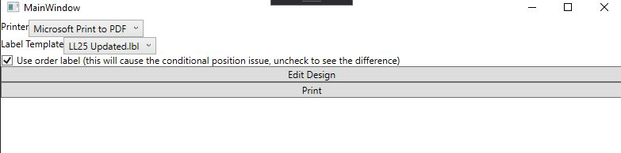

## List and Label WPF Sample with conditional position issue.
---
### The problem:  
We are updating a project that uses List and Label 15. The new project is using List and Label 25.  
The size and position of text in each label is using a conditional formula to set the value.  
For example:  
``Cond(FlipDataSource.FlipType = "6Line",1.101, 1.035)``  
The first ``FlipDataSource`` in a list is usually a sticker for the Order with ``FlipType = "7Line"`` followed by several ``FlipDataSource``s with ``FlipType = "6Line"``. List and Label 15 sets the posistion for each ``FlipDataSource`` correctly but in 25 each ``FlipDataSource`` is being set using the value from the first ``FlipDataSource``.  
Changing the data so that ``FlipType = "6Line"`` for the first ``FlipDataSource`` shows the correct positions for the following ``FlipDataSource``s, but is incorrect for the first ``FlipDataSource``.  

---
### Sample WPF Application.

I created a small WPF application to show how the relevent data is structured and how List and Label is being called and set up. This application comes with our original lbl file, the lbl file I updated for use in 25 (because the old one does not display correctly), and a lbl file I created from scratch in 25. The labels are located in ``ListAndLabelWpfSample/LabelTemplates``. Toggling the check box will change the data of the first ``FlipDataSource``.  
The code of interest is in PrinterService.cs.